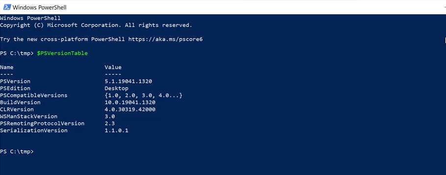

# What is PowerShell?
PowerShell is a cross-platform task automation solution made up of a command-line shell, a scripting language, and a configuration management framework. PowerShell runs on Windows, Linux, and macOS. Official PowerShell documentation can be found [here](https://docs.microsoft.com/en-us/powershell/scripting/overview)

Powershell can be used to manage and automate various systems such as M365, SharePoint, Exchange, Windows, SQL etc, however in this repository we will be focusing specifacly on Azure.

# Azure CLI vs Azure PowerShell
If your familiar with Azure, you have possibly used a command line tool such as ***Azure Cli or Azure PowerShell***. The benefit of using a scripting language is that you can standardise on processes, simplify repetative tasks and automate the management of your environment. There are a number of resources available comparing Azure Cli with Azure PowerShell so I will not go into dsetail here but this [article](https://docs.microsoft.com/en-us/azure/developer/azure-cli/choose-the-right-azure-command-line-tool) covers some of the basic differences between the two.

# Install Azure PowerShell
PowerShell can be installed on Windows, Linux and macOs but is installed on Windows by default. 
To check if PowerShell is installed on your system type the following command : ```$PSVersionTable```

The output should be similar to the below image:



If PowerShell is not installed, you can use this [link](https://docs.microsoft.com/en-us/powershell/scripting/install/installing-powershell?view=powershell-7.2) to install it on your respective system